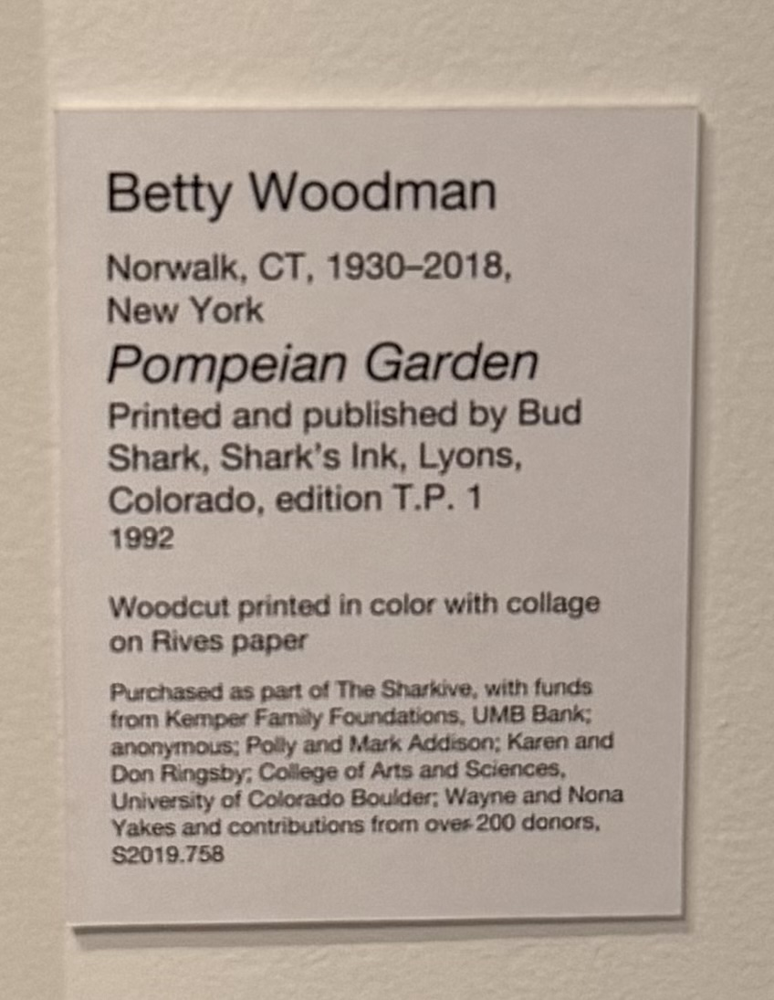
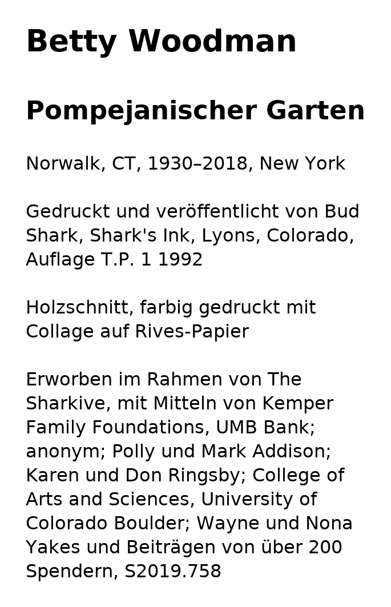
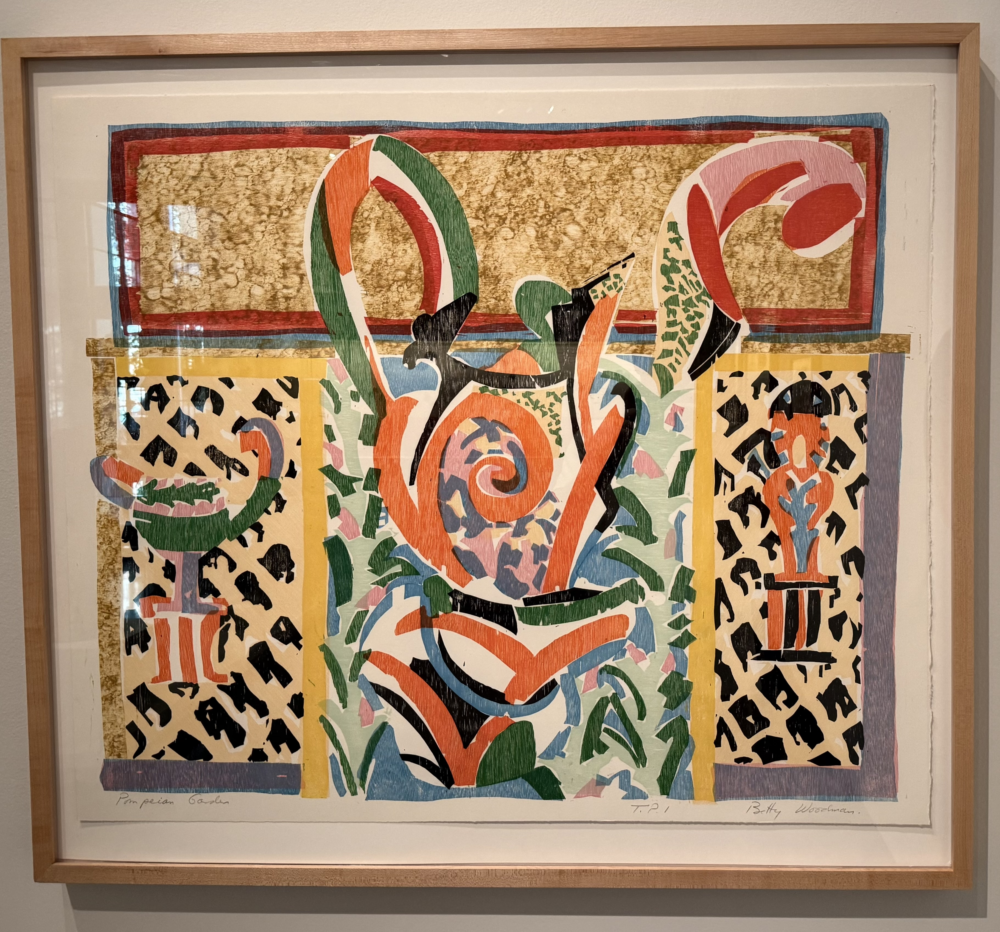

# Artwork Plate Translation
Using Ollama - locally.

Run the cells in translate.ipynb (adjust the MODEL, TARGET_LANGUAGE, etc variables accordingly) to:
1. Transcribe the text from the plate image.
2. Translate the text into the target language.
3. Re-render the plate with the translated text, preserving the original layout and style. 

## Method
Uses Gemma4:e4b locally. As seen in below example, font sizes and paragraph ordering are sometimes incorrect. A larger (cloud) model could improve results.

## Vibecoding Prompts
`translate.ipynb` was vibecoded in the following ChatGPT session: 

## Example
Given the following input plate image:

The output will be a translated plate image:

It references the following artwork that was provided as context for the translation prompt:
